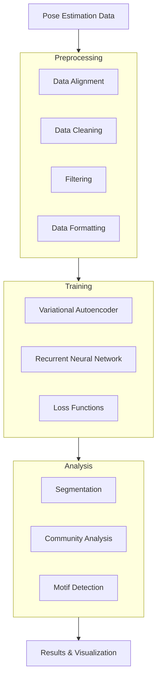
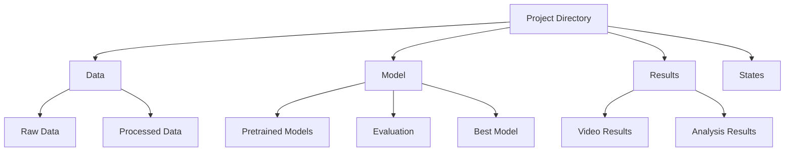
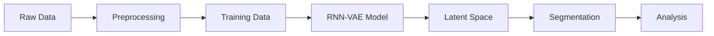

# VAME System Patterns

## System Architecture

### High-Level Architecture

## Core Components

### 1. Pipeline Management
- Class-based pipeline structure (`VAMEPipeline`)
- State management for tracking progress
- Configurable workflow steps
- Modular component design

### 2. Data Processing
- Preprocessing pipeline for pose data
- Egocentric alignment capabilities
- Data cleaning and filtering
- Format conversion and standardization

### 3. Model Architecture
- RNN-VAE (Recurrent Neural Network Variational Autoencoder)
- Encoder-decoder architecture
- Future prediction capabilities
- Customizable hyperparameters

### 4. Analysis Tools
- Behavioral segmentation
- Community detection
- Motif analysis
- UMAP visualization

## Design Patterns

### 1. Factory Pattern
- Project initialization
- Model creation
- Dataset generation

### 2. Strategy Pattern
- Multiple segmentation algorithms (HMM, K-means)
- Various loss functions
- Different preprocessing strategies

### 3. Observer Pattern
- Logging system
- Progress tracking
- State management

### 4. Builder Pattern
- Pipeline construction
- Model configuration
- Dataset preparation

## Technical Decisions

### 1. Framework Choices
- PyTorch for deep learning
- NumPy for numerical computations
- xarray for labeled multi-dimensional arrays
- tqdm for progress tracking

### 2. Data Structure

### 3. Model Design
- Variational autoencoder for dimensionality reduction
- RNN for temporal sequence modeling
- Multiple loss functions for training
- Annealed KL divergence

### 4. Performance Considerations
- GPU acceleration support
- Batch processing
- Memory-efficient data handling
- Optimized tensor operations

## Component Relationships

### 1. Data Flow

### 2. Module Dependencies
- Initialization depends on configuration
- Preprocessing required for training
- Model training precedes analysis
- Visualization depends on analysis

### 3. State Management
- JSON-based state tracking
- Progress monitoring
- Error handling
- Configuration validation

## Implementation Guidelines

### 1. Code Organization
- Modular package structure
- Clear separation of concerns
- Consistent naming conventions
- Comprehensive documentation

### 2. Error Handling
- Graceful error recovery
- Informative error messages
- State validation
- Input verification

### 3. Testing Strategy
- Unit tests for components
- Integration tests for pipeline
- Model validation procedures
- Performance benchmarks

### 4. Documentation
- API documentation
- Usage examples
- Configuration guides
- Troubleshooting information
